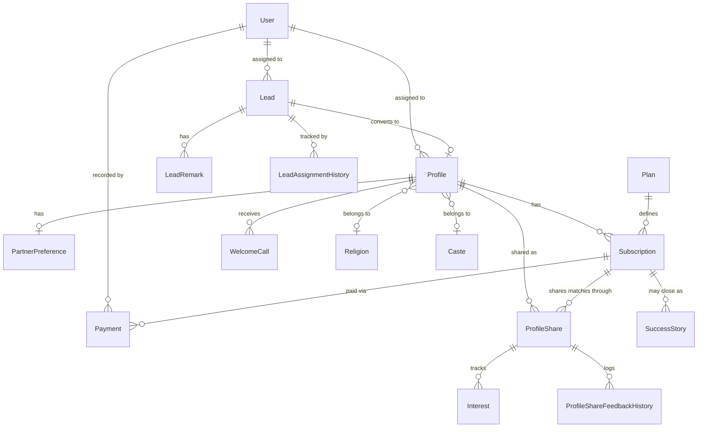
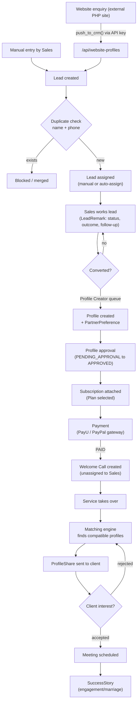
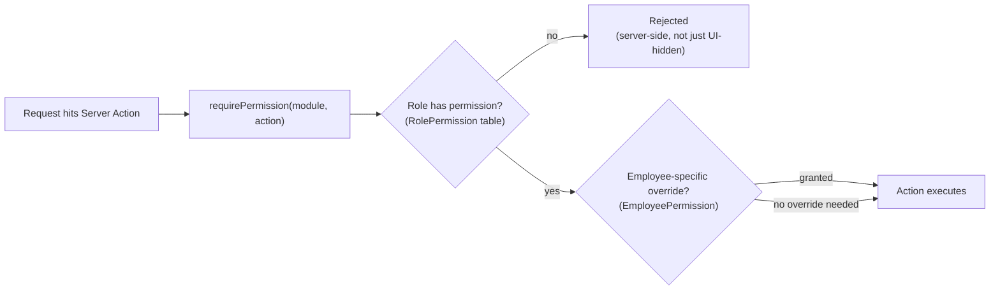

# Elite Bandhan CRM

A production matrimonial-services CRM built to replace a legacy Laravel/MySQL system, handling lead-to-client lifecycle management for a matchmaking business: lead intake, profile creation/matching, subscription and payment processing, and post-sale service delivery (profile sharing, welcome calls, success tracking).

**Live:** elitebandhancrm.cloud
**Stack:** Next.js 15 (App Router), TypeScript, Prisma ORM, PostgreSQL, NextAuth, Tailwind CSS

## Scale

- ~9,600 live client profiles
- 45+ Prisma models covering leads, profiles, subscriptions, payments, HR (attendance/leave/payroll/recruitment), and an internal team workspace
- Role-based access across 10 roles (Super Admin, Admin, Sales/Sales TL/Sales Manager, Profile Creator, Service/Service TL/Service Manager, HR)

## Architecture

- **App Router with role-scoped route groups** — `/dashboard/admin`, `/dashboard/sales`, `/dashboard/service`, `/dashboard/hr`, each gated by a permission-matrix system (`Permission`/`RolePermission` models) rather than hardcoded role checks, so access can be extended per-role without code changes.
- **Server Actions over API routes** for internal CRUD — colocated with the domain they mutate (`src/actions/leads`, `src/actions/profiles`, etc.), keeping client components thin and business logic on the server.
- **Public API surface** (`/api/public/*`, `/api/website-profiles`, `/api/website-profile-signup`) bridges a separate legacy PHP marketing site into the CRM — lead/profile creation from ~30 external web pages, and a client-facing portal for reviewing shared matches, authenticated by a scoped API key rather than session auth.
- **Soft-delete-first data model** — almost nothing is hard-deleted; a `deletedAt` pattern plus a `DeletedRecordLog` audit trail lets records be recovered and keeps referential history intact for reporting.

## Notable engineering work

**Legacy data migration.** Migrated the entire production dataset (leads, profiles, users, subscriptions, payments, partner preferences, master data like religion/caste/gotra) from a live Laravel/MySQL CRM into the new Prisma/Postgres schema, table by table, with custom scripts per entity and manual reconciliation for edge cases (duplicate accounts, encoding issues, orphaned records) — done without downtime on the legacy system during the transition.

**Custom rule-based matching engine.** Replaced a naive single-field filter (which only matched on legacy scalar fields like `religionId`/`casteId` and missed the newer multi-select preference model entirely) with a weighted two-way scoring engine (`src/lib/matching/engine.ts`): hard filters (marital status, age bounds) plus partial-credit soft criteria across religion, caste, location, lifestyle, and profession, with "Open to all" treated as automatically satisfied. Designed to degrade gracefully — most partner-preference data is sparse (~25% of records have an age range, almost none have religion/caste preferences), so missing data is scored as neutral rather than penalized. Built with no AI/embedding dependency by design, so it works standalone while a separate Ollama-based semantic layer remains optional.

**Duplicate prevention, done carefully.** Naive phone-only duplicate detection produced dozens of false positives from migration placeholder numbers and legitimate family-shared numbers. Rebuilt on name+phone compound matching (case-insensitive, soft-delete aware), applied consistently across manual entry, staff-facing forms, and the public website signup APIs, with server-side blocking (not just a UI warning) so duplicates can't slip in through any entry point.

**Multi-gateway payments.** Abstracted payment processing behind a common provider interface (`src/lib/payments/providers/`) supporting PayU and PayPal, with offer-based checkout links, webhook-driven status updates, and a state machine for payment offer lifecycle (draft → active → opened → checkout started → paid/expired/failed).

**Role-based dashboards with real permission enforcement.** Rather than one dashboard with conditional rendering, each role gets its own route tree with server-side permission checks (`src/lib/permissions/require-permission.ts`) backing every server action — UI hiding is a convenience, not the security boundary.

**Biodata PDF generation.** Server-rendered matrimonial biodata documents (`src/lib/biodata/`) built with React server rendering to PDF, pulling from the full profile + partner-preference data model, with brand-logo embedding optimized for file size.

## Key technical decisions worth discussing

- **Soft delete over hard delete**: chosen for auditability and recoverability in a business where "deleted" often means "client paused," not "data should be destroyed" — traded off against needing `deletedAt` filters threaded through nearly every query.
- **Server Actions over a separate API layer** for internal use: reduces boilerplate and keeps mutations colocated with the UI that triggers them, at the cost of them not being directly testable/callable outside the Next.js request lifecycle the way a REST endpoint would be.
- **No ORM-level multi-tenancy (yet)**: the schema is currently single-tenant by design; multi-tenant SaaS conversion was scoped (anchor-table vs. child-table `organizationId` strategy) but deliberately not built, to avoid taking on that complexity before the underlying single-tenant product was stable.
- **Weighted rule-based matching over pure ML/embeddings**: given how sparse the preference data is, a transparent, explainable scoring model (with visible match-percentage reasons) was judged more useful and debuggable than a black-box embedding similarity search, especially at this data scale.

## Local development

```bash
npm install
npx prisma db push
npm run dev
```

Requires a `.env` with `DATABASE_URL` (PostgreSQL) and `AUTH_SECRET` (NextAuth) at minimum — see `.env.example` if present, or `prisma/schema.prisma` for the full data model.


## System Architecture

### Core Entity Relationships

Simplified to the primary lifecycle entities (full schema has 45+ models — see `prisma/schema.prisma`):



### Lead-to-Client Lifecycle (request flow)



### Permission & Access Flow



### Folder Structure

```
src/
├── actions/ # Server Actions, one folder per domain
│ ├── leads/
│ ├── profiles/
│ ├── payments/
│ ├── subscriptions/
│ ├── welcome-calls/
│ └── ...
├── app/
│ ├── (auth)/login/
│ ├── (dashboard)/dashboard/
│ │ ├── admin/ # Super Admin / Admin — full access
│ │ ├── sales/ # Sales, Sales TL, Sales Manager
│ │ ├── service/ # Service, Service TL, Service Manager
│ │ ├── hr/ # HR module (attendance, payroll, recruitment)
│ │ ├── profile-creator/
│ │ ├── profile-search/
│ │ └── workspace/ # Internal team chat/mentions
│ ├── api/
│ │ ├── public/ # Client-portal + legacy-site bridge (API-key auth)
│ │ ├── webhooks/ # PayU payment webhooks
│ │ └── website-profiles, website-profile-signup/
│ └── pay/[token]/ # Public checkout flow (no auth)
├── components/
│ ├── shared/ # Cross-role components (AssignAction, DataTable, etc.)
│ ├── leads/, subscriptions/, widgets/
│ └── ui/ # Base design-system primitives
└── lib/
├── auth/ # NextAuth config, permission guards
├── matching/ # Custom scoring engine
├── payments/providers/ # PayU / PayPal / mock gateway abstraction
├── biodata/ # PDF generation
├── permissions/ # RBAC enforcement
└── stats/ # Dashboard aggregation queries
```

